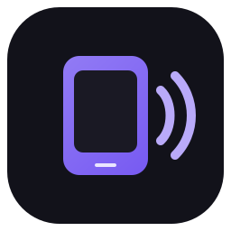

<div align="center">
  
  <h1>BlueBridge</h1>
  <p><strong>Bluetooth phone audio on Windows, routed your way.</strong></p>
  <p>
    
    
    
  </p>
  <p>
    <a href="../../releases/latest/download/BlueBridge-v1.3.0-win-x64.zip"><strong>Download for Windows</strong></a>
    · <a href="#installation">Installation</a>
    · <a href="#building-from-source">Build from source</a>
  </p>
</div>

---

BlueBridge turns a paired Bluetooth phone into an audio source on your Windows PC and lets you choose where that audio plays. Route it to a headset, speakers, an audio interface, or a mixer such as GoXLR—without permanently changing your normal Windows default output.

## Why BlueBridge?

- **Per-device output routing** — choose a dedicated playback device for phone audio.
- **Brand-independent discovery** — uses Windows Bluetooth audio discovery rather than a hard-coded phone model or manufacturer.
- **Default-device-safe binding** — BlueBridge temporarily binds the A2DP stream to the selected output, then restores your original Windows defaults.
- **One-click manual repair** — rebuilds the phone audio stream exactly once when Bluetooth stays connected but audio goes silent.
- **No intrusive background polling** — there is no periodic health check touching or interrupting the stream.
- **Lightweight native desktop app** — WPF UI, notification-area support, and no browser runtime.
- **Practical mixer support** — useful with virtual and physical endpoints such as System, Music, Game, or Chat routes.
- **Quiet startup** — optional start-with-Windows, auto-connect-on-launch, and close-to-tray behavior.
- **Transparent and open source** — the complete application source and build workflow are available here.

## What makes it different

BlueBridge focuses on the awkward real-world case where the phone remains paired and connected, but its Windows A2DP receive stream stops producing audio. It keeps recovery deliberate and predictable: one repair click performs one close/open cycle—never a hidden retry loop.

Its routing flow also works around the way Windows initially binds the received Bluetooth stream. The selected output is made default only for the short binding window, the stream is pinned to that endpoint where Windows exposes the session, and the user's original default roles are restored immediately.

## Requirements

- Windows 10 version 2004 or later; Windows 11 recommended
- A Bluetooth adapter that supports receiving A2DP audio
- A phone already paired in Windows Bluetooth settings
- x64 PC

## Installation

1. Download **[BlueBridge-v1.3.0-win-x64.zip](../../releases/latest/download/BlueBridge-v1.3.0-win-x64.zip)**.
2. Extract the entire ZIP.
3. Run `INSTALL.cmd`.
4. Choose your Bluetooth audio device and playback output, then select **Connect device audio**.

The installer is per-user, does not require administrator privileges, creates Start Menu/Desktop shortcuts, and registers a normal Windows uninstall entry.

> Close any other Bluetooth audio receiver before connecting so only one app owns the phone audio port.

## Using BlueBridge

1. Pair the phone through **Settings → Bluetooth & devices**.
2. Select it under **Bluetooth audio device**.
3. Select the desired endpoint under **Play sound through**.
4. Click **Connect device audio**.
5. If the phone stays connected but audio becomes silent, click **Repair audio**. Each click performs exactly one repair attempt.

Changing the output while connected performs one explicit rebind. BlueBridge does not continuously monitor or reset the stream.

## Privacy

BlueBridge runs locally. It does not collect analytics, send telemetry, upload audio, or require an account. Logs stay in `%LOCALAPPDATA%\BlueBridge`.

## Building from source

Install the [.NET 10 SDK](https://dotnet.microsoft.com/download/dotnet/10.0), then run:

```powershell
dotnet restore .\src\BlueBridge.csproj
dotnet build .\src\BlueBridge.csproj -c Release
dotnet publish .\src\BlueBridge.csproj -c Release -r win-x64 --self-contained true
```

Or run `build.ps1` to create a publish directory in `artifacts\publish`.

## Project structure

```text
src/                 WPF application source
src/Services/        Bluetooth receiver, routing, settings, and startup logic
src/Models/          Application data models
src/Assets/          Application icon and artwork
installer/           Per-user installation and uninstallation scripts
.github/workflows/   Reproducible Windows build workflow
```

## Third-party component

BlueBridge redistributes the unmodified **SoundVolumeCommandLine** utility by NirSoft for Windows audio endpoint selection. It remains under its own license; see [THIRD-PARTY-NOTICES.md](THIRD-PARTY-NOTICES.md) and the original files in `src/vendor/svcl/`.

## Contributing

Bug reports and focused pull requests are welcome. Please read [CONTRIBUTING.md](CONTRIBUTING.md) before contributing.

## License

BlueBridge's source code is released under the [MIT License](LICENSE). Bundled third-party files are covered by their respective licenses.
